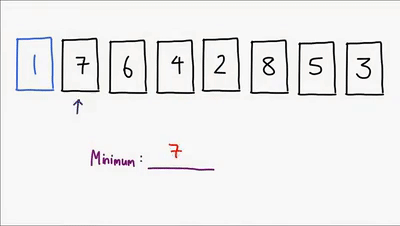
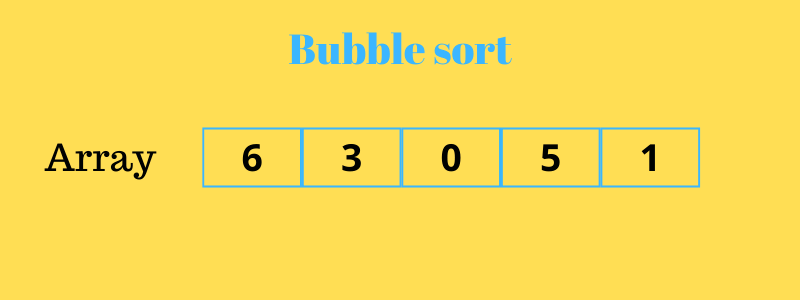

# Sorting

1. Selection sort
2. Bubble sort
3. Insertion sort
4. merge sort
5. quick sort
6. heap sort
7. radix/counting/bucket sort
  
[When Use which sorting](https://code.likeagirl.io/5-essential-sorting-algorithms-you-should-know-for-your-next-coding-interview-ffc048b0c95a)


| Algorithms | Basic Concept | Time Complexity |
|:----------:|:-------------|:--------------|
| Selection sort | select the smallest element from an unsorted list in each iteration and places that element at the beginning of the unsorted list.| `O(n^2)` - worst, average, and best. stability `no`|
|Bubble Sort | compares two adjacent elements and swaps them until they are in the intended order|`O(n^2)` - worst, average case but `O(n)` - best case , stability `yes`|  
|Insertion sort|places an unsorted element at its suitable place in each iteration| `O(n^2)` - worst, average case `O(n)` - best case stability `yes`|



``` CPP
// Selection sort
/* Dry run
*[5,4,3,2,1]
* i= [0, n-2]
* minIndex = i;
* j = [i, n-1];
*   if arr[minIndex] > arr[j] than minIndex = j
* swap(arr[minIndex], arr[i]);
*/
for(int step = 0; step < n-1; step++){
  int minIndex = step;
  for(int i = step+1; i < n; i++){
    if(arr[minIndex]>[arr[j]]) minIndex = i;
  }
  swap(arr[step], arr[minIndex]);
}
```



```CPP
//Bubble sort - optimization check swap
for(int step = 0; step < n; step++){
 // each step last element will be sorted so no need to include for comparison.
 bool swapped = false;
  for(int i = 0; i < n - step; i++)
    if(arr[i] > arr[i+1]) 
      swap(arr[i], arr[i+1]), swapped = true;
  if(swapped == false) break;
}
```

]

```CPP
//Insertion sort
for(int step = 0; step < n; step++){
  int i = step;
  while(i > 0 && arr[i-1] > arr[i]) swap(arr[i-1], arr[i]), i--;
}

```
